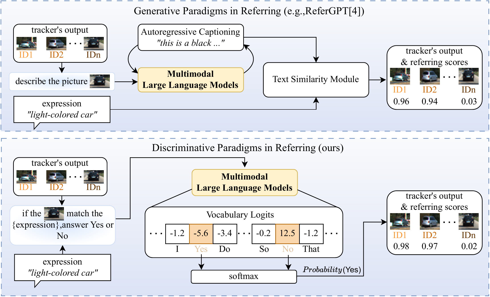

<h1 align="center">
  <i>YesTrack: Referring Multi-Object Tracking<br>
  via MLLM-based Yes/No Verification</i>
</h1>

<p align="center">
  Quansheng Hu<sup>1</sup>,&nbsp;
  Qin Sun<sup>1</sup>,&nbsp;
  Qiansen Dai<sup>1</sup>,&nbsp;
  Jin Ding<sup>1</sup>,&nbsp;<br>
  Wan Zhang<sup>1</sup>,&nbsp;
  Xue Zhou<sup>2,1,*</sup>,&nbsp;
  Jianxiao Zou<sup>2</sup>,&nbsp;<br>
  <sup>1</sup> University of Electronic Science and Technology of China, Chengdu, China<br>
  <sup>2</sup> Shenzhen Institute for Advanced Study, UESTC<br>
  <sup>*</sup> Corresponding author<br>
  📧 Primary Contact: huhansan@std.uestc.edu.cn
</p>

<p align="center">
  
</p>


## :mag: Overview

**TL; DR.** We propose YesTrack, a two-stage framework that ***reformulates referring multi-object tracking as direct Yes/No reasoning with multimodal large language models***. By avoiding autoregressive caption generation and additional text-matching modules, YesTrack provides a direct and efficient solution for referring. Temporal Confidence Prior (TCP) and Temporal Reference Propagation (TRP) further improve temporal reliability, while YesTrack-MOT extends this discriminative paradigm to generic multi-object tracking.




## :fire: News

- <span style="font-variant-numeric: tabular-nums;">**2026.07.22**</span>: The Refer-KITTI V1/V2 LoRA weights, TempRMOT* pure tracking results, and pre-generated evaluation GT are released in [Models and Results](#open_file_folder-models-and-results), completing the planned resource release :tada:.
- <span style="font-variant-numeric: tabular-nums;">**2026.07.12**</span>: The ~~verified codebase~~, ~~requirements~~, and ~~basic usage instructions~~ were planned for release before this date. All items were completed ahead of schedule :tada:.
- <span style="font-variant-numeric: tabular-nums;">**2026.07.10**</span>: The current codebase has been verified and can run successfully :tada:. Basic commands for training, inference, and metric evaluation are now available in [Quick Start](#dash-quick-start) :rocket:.
- <span style="font-variant-numeric: tabular-nums;">**2026.06.30**</span>: The initial [requirements](./requirements.txt) file is uploaded ahead of schedule :tada:.
- <span style="font-variant-numeric: tabular-nums;">**2026.06.29**</span>: The initial codebase is released :tada:. This repository was directly converted and organized by Codex from my original project files and is still under verification :construction:. I have been a little busy lately, so updates may be slower. For urgent code issues before July 12, please contact [huhansan@std.uestc.edu.cn](mailto:huhansan@std.uestc.edu.cn) :email:. The original version can be provided if needed, although it may be somewhat messy.

## :open_file_folder: Models and Results

<p align="center">
  <a href="https://pan.baidu.com/s/1nwhcEIQshWk9TnNjhiYMrQ"><b>Baidu Netdisk</b></a>
  &nbsp;|&nbsp; Extraction code: <code>z5kt</code>
</p>

| Folder | Dataset | Description |
| :--- | :---: | :--- |
| `refer_kitti_motc_gt` | Refer-KITTI V1 | Pre-generated MOTChallenge-format evaluation GT with a 158-entry seqmap. |
| `refer_kitti_motc_gt_v2` | Refer-KITTI V2 | Pre-generated MOTChallenge-format evaluation GT. |
| `v1bestweight` | Refer-KITTI V1 | Trained YesTrack LoRA weights. |
| `v2bestweight` | Refer-KITTI V2 | Trained YesTrack LoRA weights. |
| `v1best_track_result` | Refer-KITTI V1 | TempRMOT* pure tracking results used as candidate tracks for YesTrack. |
| `v2best_track_result` | Refer-KITTI V2 | TempRMOT* pure tracking results used as candidate tracks for YesTrack. |

> [!IMPORTANT]
> **Refer-KITTI V1 evaluation protocol.** The released `refer_kitti_motc_gt` is converted directly from the dataset annotations, and its seqmap contains **158 evaluation entries**. This is more complete and, in our tests, more challenging than the reduced seqmaps used by TransRMOT or TempRMOT. Evaluating YesTrack with those reduced seqmaps typically raises HOTA by approximately **0.5–1.0 points**. All metrics reported in our paper were obtained with the released 158-entry seqmap; for direct comparison with other methods, you may instead use their reduced seqmap, provided that the evaluation protocol is clearly stated.

> [!NOTE]
> **Weight-specific classification thresholds.** Negative samples were downsampled when training the released V2 weight. This had little effect on overall performance in our tests, but shifted confidence calibration: the best classification threshold is approximately **0.4 for V1** and **0.6 for V2**. Use these as starting points and verify them on the matching validation protocol with `eval_refer_kitti_mot.py --thresholds`.

**TempRMOT*** denotes the pure tracker reported in the paper: it is trained from TempRMOT with the text module removed. The released `best_track_result` folders contain its MOT candidates before YesTrack applies MLLM-based Yes/No referring reasoning; they are not the final YesTrack referring predictions.

Choose the GT, weight, and tracking-result folders that match the same dataset version. Pass the LoRA adapter directory containing `adapter_config.json` to `--lora_path`, the corresponding `best_track_result` folder to `--results_root`, and the GT folder to `eval_refer_kitti_mot.py --gt-folder`. The GT can also be regenerated with [`prepare_refer_kitti_motc_gt.py`](./tools/prepare_refer_kitti_motc_gt.py). See [Usage](./docs/USAGE.md#released-resources) for details.

## :dash: Quick Start

If you encounter an error or obtain performance below the paper result, check [Possible Issues](./docs/POSSIBLE_ISSUES.md) first. In particular, verify every 0-based/1-based frame conversion before changing model parameters.

### Training

Single-frame training (default):

```bash
torchrun --nproc_per_node=2 refer_llm/llm_train.py
```

Joint single-frame and video-clip training:

```bash
torchrun --nproc_per_node=2 refer_llm/llm_train.py \
  --enable_video_mode \
  --train_both_modes \
  --video_n_frames 3
```

Video-only training:

```bash
torchrun --nproc_per_node=2 refer_llm/llm_train.py \
  --enable_video_mode \
  --video_only \
  --video_n_frames 3
```

- `--enable_video_mode` makes the video dataset available, but does not select video samples by itself.
- `--train_both_modes` combines the single-frame and video datasets. It only takes effect together with `--enable_video_mode`.
- `--video_only` selects only video samples and requires `--enable_video_mode`.
- `--video_n_frames` controls the maximum number of historical frames for each video sample. Missing target frames are skipped.

Training-time evaluation is configured separately: selective video refinement is controlled by `--re_refer_lower`, `--re_refer_thresh`, and `--prompt_video_tpl`, rather than by the training-side `--enable_video_mode` flag.

### Inference

Default inference:

```bash
python refer_llm/llm_eval_from_mot.py
```

By default, the script performs single-frame inference, selectively refines confidence scores in `[0.2, 0.8)` with a multi-frame clip, enables TRP with an interval of 4, and keeps TCP disabled.

Inference with TCP and TRP explicitly enabled:

```bash
python refer_llm/llm_eval_from_mot.py \
  --stability_enable \
  --stability_window 6 \
  --stability_thresh 0.4 \
  --stability_boost 0.3 \
  --infer_every_n_frames 4
```

TCP parameters:

- `--stability_enable` enables Temporal Confidence Prior (TCP).
- `--stability_window 6` keeps the latest 6 output confidence scores for each track ID.
- `--stability_thresh 0.4` requires all confidence scores in the history window to be at least `0.4`.
- `--stability_boost 0.3` adds `0.3` to the current confidence when the history is stable, with the result clipped to `1.0`.
- TCP uses only previous frames. The final output confidence, including refinement, propagation, and any TCP boost, is stored for subsequent frames.

TRP parameter:

- `--infer_every_n_frames 4` enables Temporal Reference Propagation (TRP): a full inference pass is performed every 4 processed frames, while intermediate frames reuse the latest confidence for each existing track ID. A newly appearing ID is inferred immediately. Set it to `1` to infer every frame.

Full video-mode inference:

```bash
python refer_llm/llm_eval_from_mot.py \
  --enable_video_mode \
  --video_n_frames 4 \
  --stability_enable \
  --infer_every_n_frames 4
```

During inference, `--enable_video_mode` switches the complete primary inference path from single-frame inputs to multi-frame clips. For each track ID, it uses up to `video_n_frames` historical crops ending at the current frame. This differs from the training option with the same name: during training, `--enable_video_mode` only prepares video samples and must be combined with `--train_both_modes` or `--video_only` to change the training data.

Use `--disable_refine` for single-frame inference without the selective second-stage video refinement.

### Metric Evaluation

```bash
python eval_refer_kitti_mot.py
```
